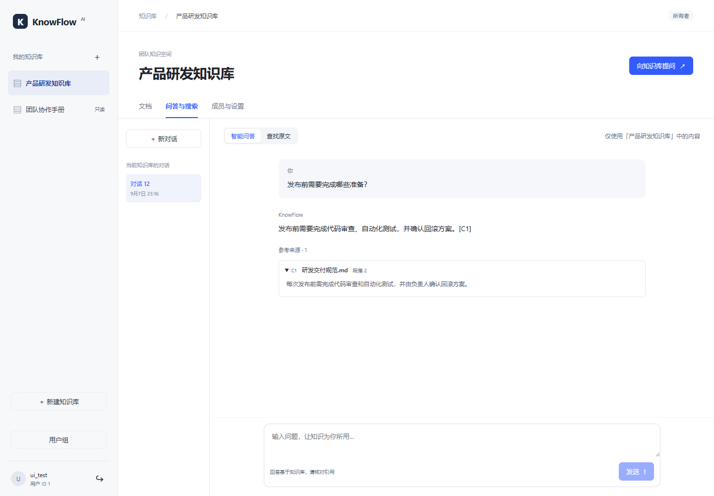
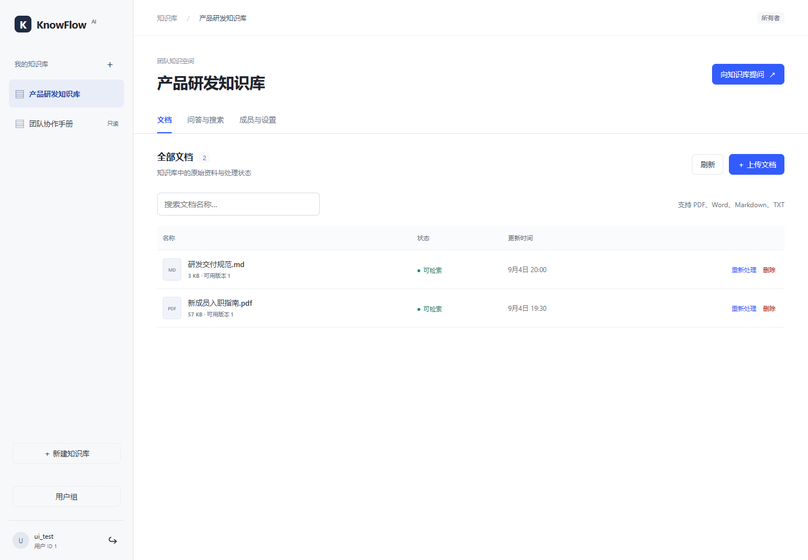
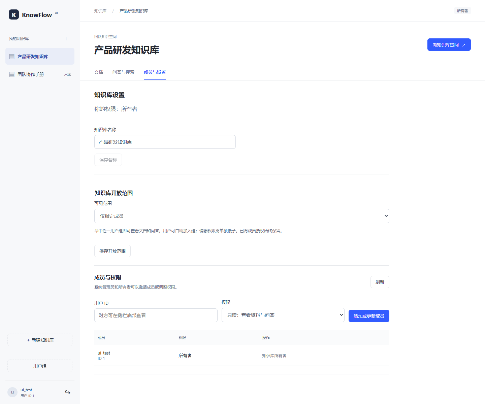
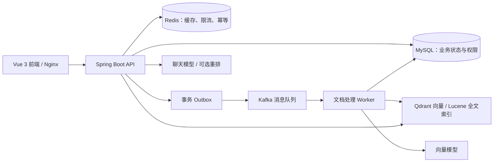

# KnowFlow AI

**让团队文档成为可检索、可追溯、有权限边界的知识。**

KnowFlow AI 是一个企业知识治理与智能检索平台。上传制度、研发规范或业务手册后，团队成员可以搜索原文、用自然语言提问，并展开回答中的引用核对出处。项目覆盖文档处理、知识库授权、检索问答和模型调用管理，适合团队内部知识共享，也适合展示 Java 后端与 AI 应用工程实践。

[界面预览](#界面预览) · [技术亮点](#技术亮点) · [快速启动](#快速启动) · [验证与边界](#验证与边界) · [更新记录](CHANGELOG.md)

## 可以用它做什么

| 场景 | 使用方式 |
| --- | --- |
| 新成员查阅资料 | 集中管理入职指南、操作手册，搜索原文或直接提问 |
| 研发知识沉淀 | 上传发布规范和技术文档，展开回答引用核对原文片段 |
| 团队资料共享 | 设置仅指定成员、全员只读或指定用户组只读，单独授予编辑权限 |
| 文档持续更新 | 查看处理阶段、重建索引、删除过期资料，后台异步处理 |
| 连续追问 | 保存个人会话，支持流式输出、停止生成和可选的上下文查询改写 |

支持 PDF、DOCX、Markdown 和 TXT，默认单文件上限 10 MB。PDF 需要包含可提取文本；当前未接入扫描件 OCR。

## 界面预览

以下为当前 Vue 前端的实际浏览器截图，使用仓库自带的本地协议演示服务与虚构资料。截图展示交互和布局，示例回答由固定测试数据提供，不代表真实模型效果。复现方法见 [前端说明](frontend/README.md)。

### 智能问答：回答附带可展开的原文引用



### 文档管理：集中查看资料与可检索状态



### 成员与设置：控制开放范围和编辑权限



## 技术亮点

| 工程问题 | 项目实现 | 深入阅读 |
| --- | --- | --- |
| 上传不应等待模型和解析 | API 在事务中创建任务与 Outbox，Kafka 投递给 Worker；任务支持幂等、租约、重试与恢复 | [任务恢复](docs/task-recovery.md) |
| 召回结果不能替代权限判断 | MySQL 保存业务状态与授权，检索返回前复核文档状态、激活版本与访问权限 | [权限设计](docs/departments.md) |
| 精确匹配与语义检索各有所长 | Lucene BM25、Qdrant 向量检索、RRF 融合，支持可选重排及失败回退 | [混合检索](docs/bm25-design.md)、[重排](docs/rerank-design.md) |
| 回答需要可核对的证据 | 同步与 SSE 问答附原文引用；会话读取复核权限，来源删除或失效时隐藏相关内容 | [问答](docs/answer-design.md)、[会话](docs/conversation-design.md) |
| 模型可能超时且产生费用 | 连接、首字、空闲与总时限，有限重试及备用模型；记录调用尝试、用量、价格快照和预算 | [模型韧性](docs/model-resilience-design.md)、[预算](docs/model-budget-design.md) |
| 外部索引可能与业务库不一致 | 重建成功后切换激活版本，删除采用逻辑屏蔽与异步向量清理，提供只读对账和恢复演练 | [外部对账](docs/external-reconciliation.md)、[恢复演练](docs/recovery-drill.md) |

### 架构与技术栈

同一 Spring Boot 应用制品分别运行 API 与 Worker 两个进程。API 负责认证、管理和检索问答，Worker 负责文档解析、分块及索引处理。



| 层次 | 技术 |
| --- | --- |
| 前端 | Vue 3、TypeScript、Vite，原生 fetch 与 SSE |
| 后端 | Java 25、Spring Boot 4.1.1、Spring AI 2.0.1、Spring Security |
| 数据与任务 | MySQL、Flyway、Redis、Kafka |
| 检索与解析 | Qdrant、Lucene、PDFBox、Apache POI |
| 交付与验证 | Docker Compose、Nginx、Maven Wrapper、集成测试与评测脚本 |

## 快速启动

推荐使用 Docker Compose 启动完整应用，需要支持 Linux 容器的 Docker 环境。在仓库根目录执行：

```powershell
# 仅首次执行；已有 .env 时请保留原配置
Copy-Item .env.example .env
```

编辑 `.env`，填写不同的随机 `DB_PASSWORD`、`MYSQL_ROOT_PASSWORD`，以及至少 32 个随机字节的 Base64 编码 `JWT_SECRET`。可在 PowerShell 7 中生成 JWT 密钥：

```powershell
[Convert]::ToBase64String([Security.Cryptography.RandomNumberGenerator]::GetBytes(32))
```

默认关闭模型能力。体验完整检索问答前，需配置实际可用的模型地址、名称、密钥与向量维度，并设置 `EMBEDDING_ENABLED=true`、`BM25_ENABLED=true`、`CHAT_ENABLED=true`。模型预算默认启用，价格未知或预算不足会阻止调用；配置与排查见 [本地部署](docs/local-deployment.md) 和 [预算设计](docs/model-budget-design.md)。密钥只保存在本地 `.env`。

```powershell
docker compose --profile app up -d --build --wait --wait-timeout 180
```

- 应用入口：[http://127.0.0.1:8088](http://127.0.0.1:8088)
- 接口文档：[Swagger UI](http://127.0.0.1:8088/swagger-ui/index.html)
- 体验路径：注册并登录 → 创建知识库 → 上传资料 → 等待可检索 → 提问并核对引用。

停止服务可运行 `docker compose --profile app stop`，保留数据。当前 Compose 面向本机演示，宿主端口仅绑定回环地址。

## 验证与边界

- **检索评测**：20 篇文档、50 条人工构造问题；该样本中 Hybrid 的 Recall@5、MRR@5、nDCG@5 均为 1.00，重排没有进一步提升。结果不代表开放场景的普遍准确率，见 [真实评测与原始结果](docs/evaluation-v1.md)。
- **问答引用**：10 条真实模型案例，8 条有引用回答、2 条证据不足拒答。引用校验不等同于人工事实正确率，见同一评测记录。
- **并发边界**：已有真实模型低并发基线；协议替身压测在并发 5 / 10 时复现 SSE 会话写入锁竞争与 HTTP 503，尚不能宣称高并发稳定，见 [压测记录](docs/load-testing.md)。
- **权限边界**：当前一个部署对应一家公司；用户组支持自助加入，不是部门准入审批。敏感资料应使用仅指定成员，尚未提供多租户隔离。

开发验证命令（后端需要 JDK 25 与可用的 Docker，前端建议 Node 24）：

```powershell
.\mvnw.cmd test
npm --prefix frontend ci
npm --prefix frontend test
npm --prefix frontend run build
```

## 文档导航

| 想了解的内容 | 入口 |
| --- | --- |
| 部署和使用 | [本地部署](docs/local-deployment.md)、[前端使用](frontend/README.md) |
| 面试演示与项目讲解 | [项目交付材料](docs/project-delivery.md)、[实施设计](docs/design.md) |
| 进度与变更 | [更新记录](CHANGELOG.md)、[实施进度](docs/roadmap.md) |
| 评测与复现 | [检索评测集](evaluation/v1/README.md)、[真实验证](docs/live-validation.md)、[容器验收](docs/compose-validation.md) |

源码位于 `src/`，前端位于 `frontend/`，技术文档位于 `docs/`，评测样本位于 `evaluation/`，演示与验证脚本位于 `scripts/`。
