# KnowFlow AI

### 企业知识管理与智能问答平台

KnowFlow AI 用于集中管理团队的制度、手册和业务文档。员工可以按关键词查找原文，也可以直接提问，获取带文档出处的回答；资料维护人员负责上传、更新和共享，系统根据知识库成员和用户组控制访问范围。

项目包含 Vue 前端、Spring Boot 后端、异步文档处理、混合检索和大模型问答，并提供容器化部署、调用记账及索引对账能力。

[功能概览](#功能概览) · [使用场景](#使用场景) · [用户组与权限](#用户组与权限) · [技术实现](#技术实现) · [部署与文档](#部署与文档)

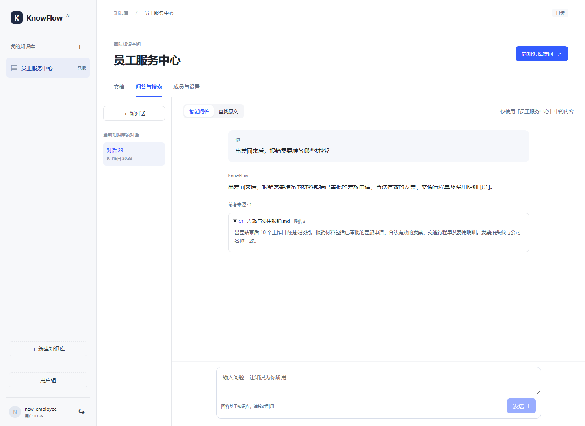

## 功能概览

| 功能 | 说明 |
| --- | --- |
| 知识库管理 | 按团队、项目或主题组织资料，设置名称、成员和共享范围 |
| 文档管理 | 支持 PDF、DOCX、Markdown、TXT 上传，查看处理状态和索引版本，重新处理或删除文档 |
| 原文搜索 | 支持关键词检索、语义检索、混合检索及重排，返回文档名称、原文片段和页码或段落编号 |
| 智能问答 | 根据知识库内容生成回答，逐步显示正文，附可展开的原文引用 |
| 个人会话 | 保存提问与回答，查看历史记录，在同一会话中继续提问或停止生成 |
| 成员协作 | 区分所有者、编辑者和只读成员，支持全员共享和指定用户组共享 |
| 运行管理 | 提供接口限流、请求幂等、模型调用统计、费用估算、预算控制和索引对账 |

## 使用场景

以下截图来自本地运行的完整应用，使用人力行政、产品研发、客户服务三组示例资料；问答与检索连接实际模型服务。示例文档保存在 [docs/examples](docs/examples)。

### 人力行政：维护制度，供员工自行查询

人力行政人员将入职指南、差旅报销制度、设备申请说明放入“员工服务中心”。文档列表显示文件类型、处理状态和更新时间；维护人员可以上传新资料、重新处理文档或删除旧资料。

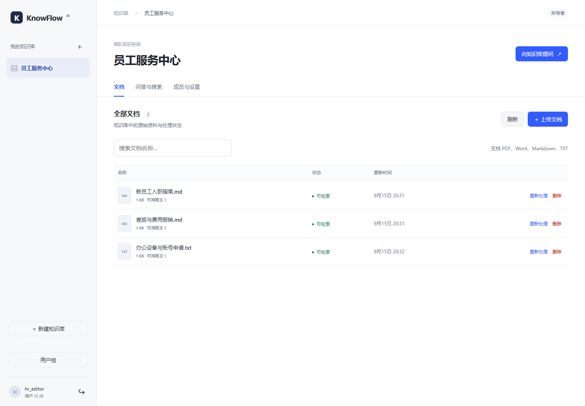

员工登录后以只读方式访问这些资料。页面保留查询入口，并按其权限显示可用操作。

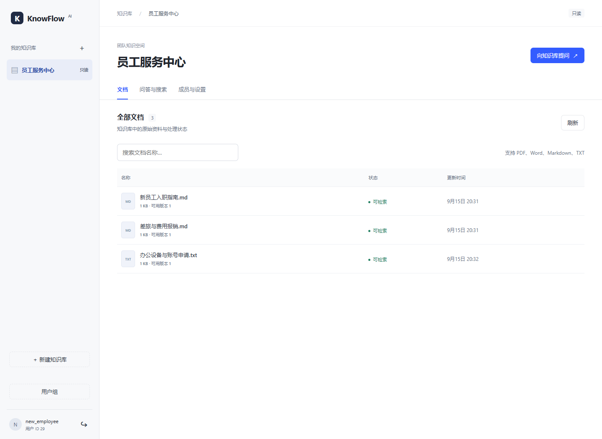

例如，员工询问“出差回来后，报销需要准备哪些材料？”，系统从《差旅与费用报销》中找到相关条款，回答所需材料，并附上段落引用。员工可以继续询问提交期限，同一会话保留两次问答和各自的出处。

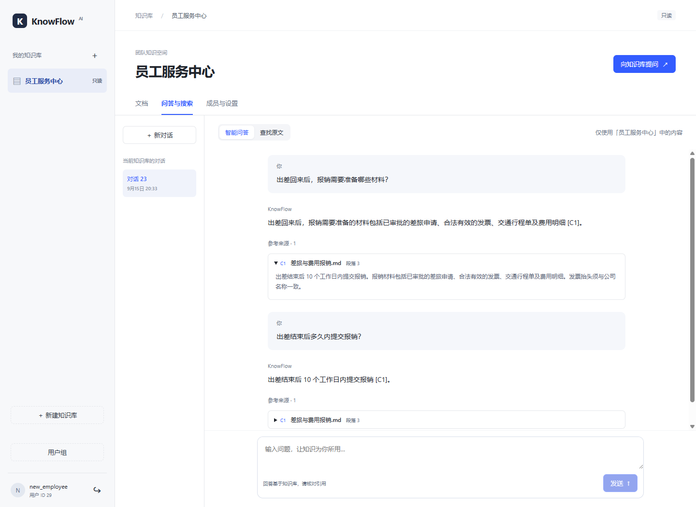

### 产品研发：管理交付资料，核对发布要求

研发账号可以同时访问全员共享的“员工服务中心”和本组的“研发交付知识库”。示例中的研发账号被单独授予编辑权限，可以维护发布清单、故障响应流程和接口评审约定。

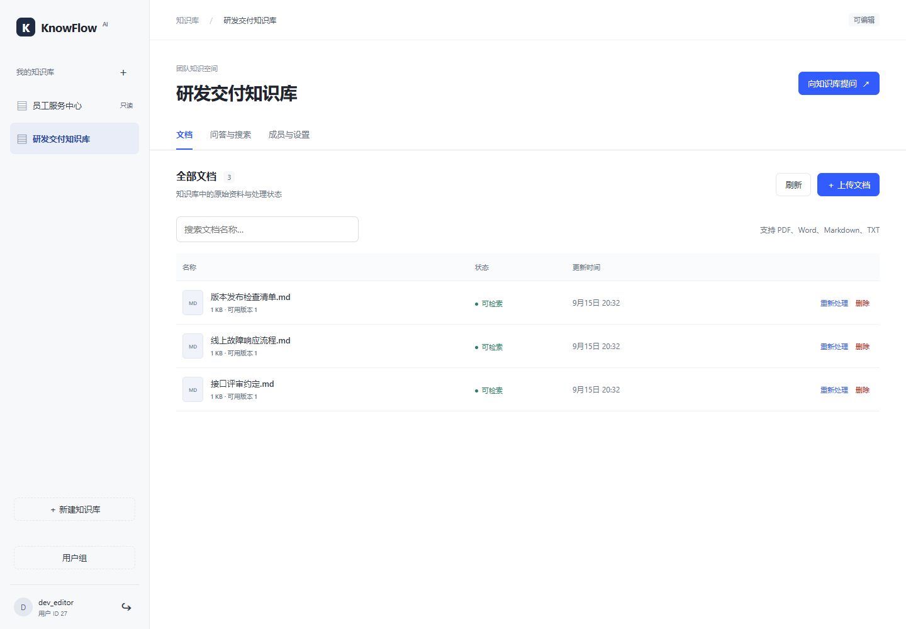

点击文档可以查看处理状态与当前索引版本，再进入问答与搜索查找内容。

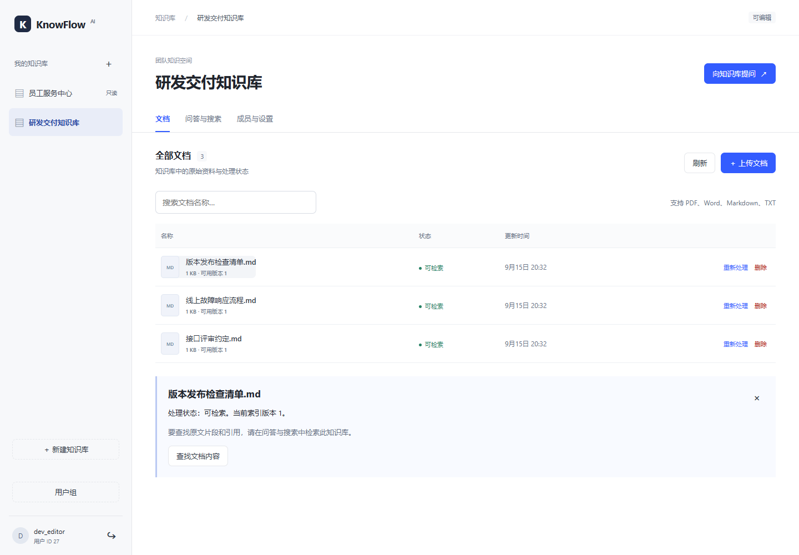

发布前，研发人员可以直接询问检查事项。回答从发布规范中整理代码审查、自动化测试、数据库变更、发布单和回滚方案等要求，引用分别对应原文段落。

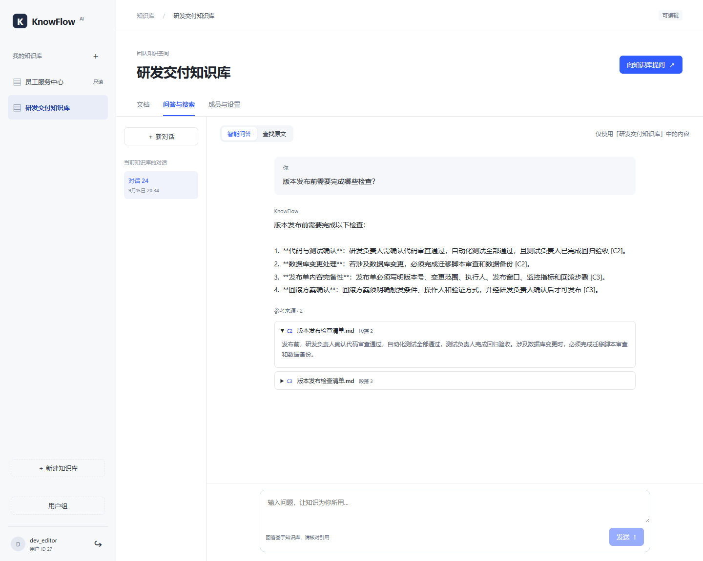

需要直接核对条款时，可以切换到“查找原文”。输入“发布回滚方案”，页面展示相关片段及其出处；检索选项支持选择关键词、语义或混合检索，并开启重排。

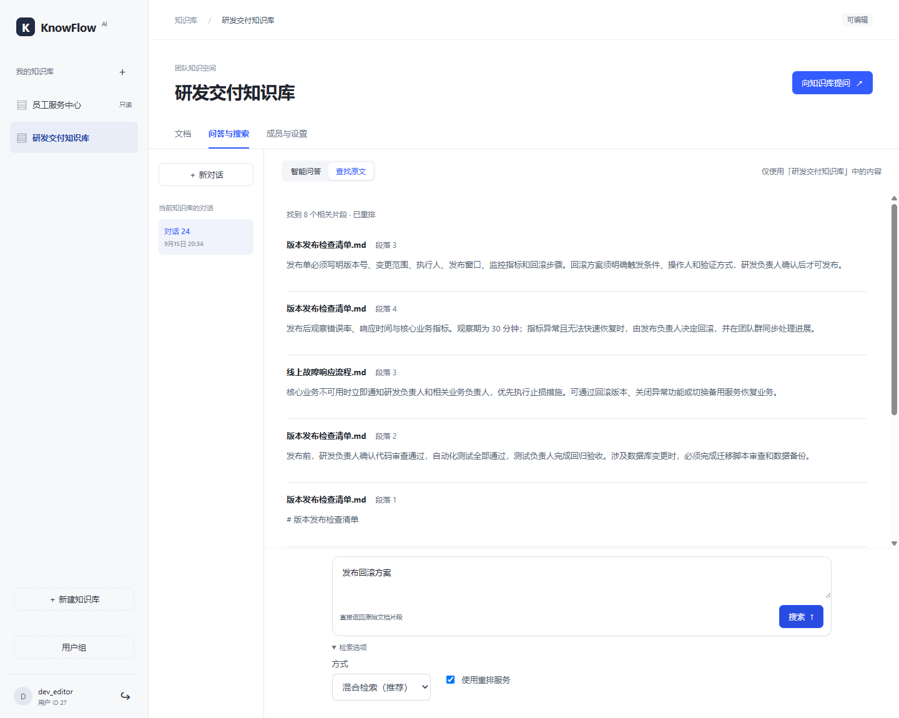

### 客户服务：查阅处理流程，统一回复依据

客服账号能查看公共制度和“客户服务手册”。遇到紧急客户问题时，可以查询响应时限、需要通知的人员以及升级流程。示例回答引用《客户问题分级与升级》，给出响应时间和协作对象，客服可以直接展开核对。

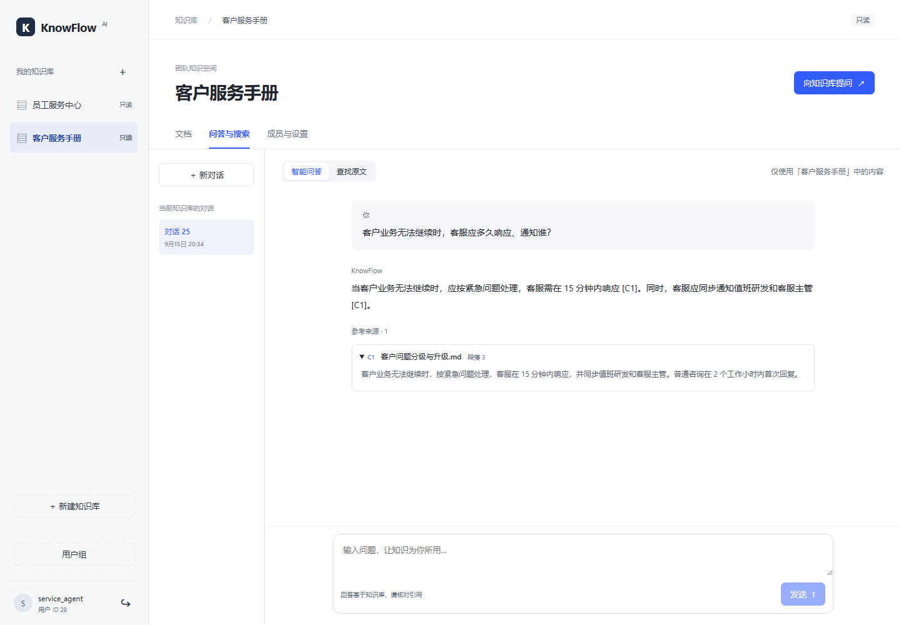

## 用户组与权限

系统同时支持按用户组共享和单独授权。用户组负责组织共享范围，成员角色决定在知识库中可以进行哪些操作。

### 按团队组织资料

管理员创建用户组，用户可以加入或退出，也可以同时属于多个组。加入后即可访问对该组开放的知识库。下图中的研发账号已加入“产品研发组”。

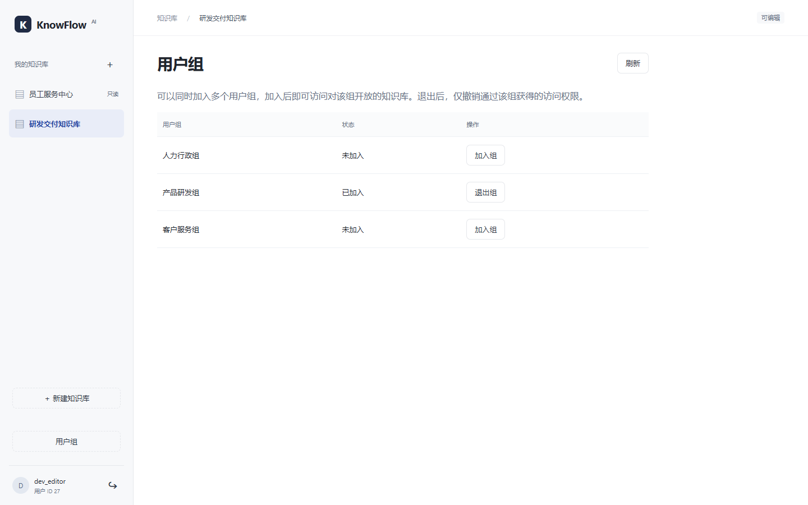

### 为公共制度设置全员只读

“员工服务中心”由人力行政账号维护，开放范围设为“全员只读”。已登录员工可以阅读、搜索和提问，文档维护权限由所有者和单独授权的编辑者持有。

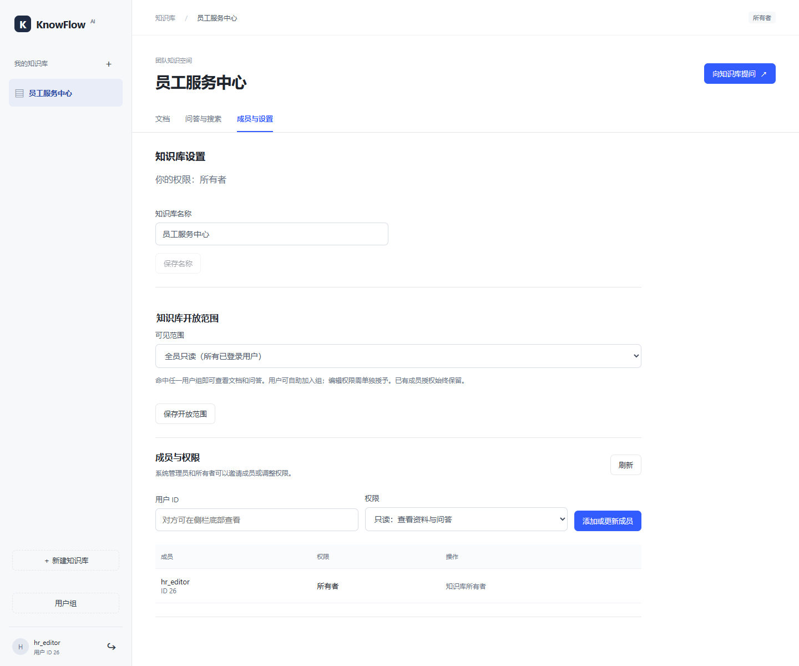

### 为专业资料指定用户组并授予编辑权限

“研发交付知识库”对产品研发组开放只读访问，同时将 `dev_editor` 单独设为编辑者。管理员可在同一页面管理共享范围、添加成员、调整角色或移除成员。

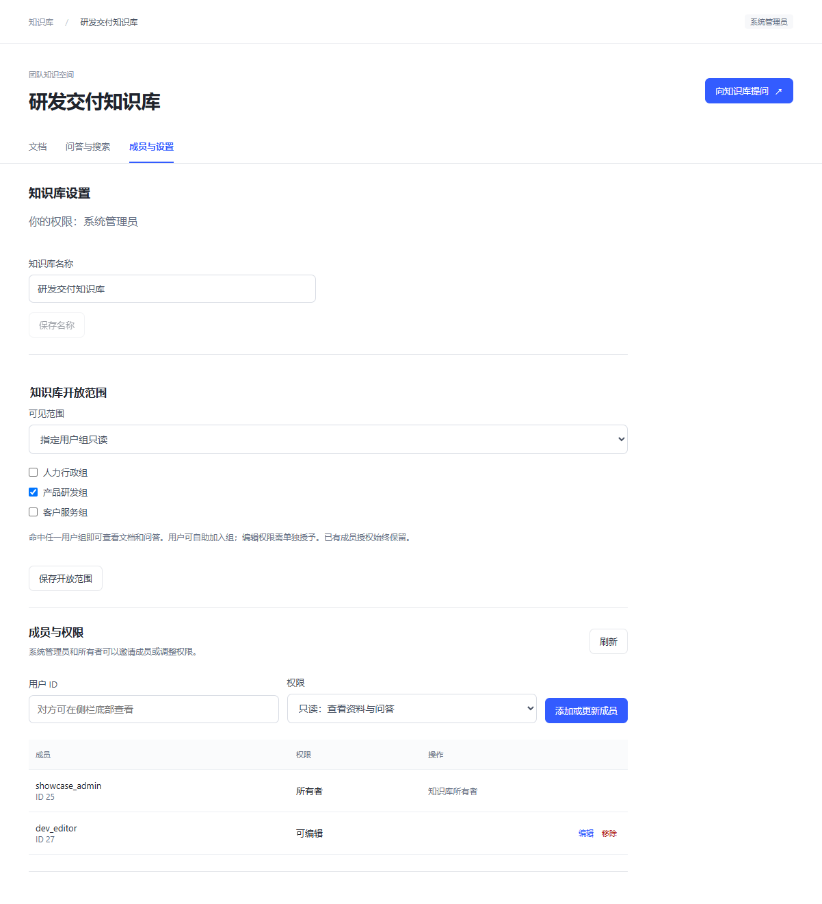

示例中的账号分工如下：

| 账号 | 身份与分组 | 可访问的示例知识库 | 主要操作 |
| --- | --- | --- | --- |
| `hr_editor` | 人力行政组、员工服务中心所有者 | 员工服务中心 | 维护制度文档、设置全员共享 |
| `new_employee` | 普通员工 | 员工服务中心 | 阅读资料、查询制度、连续提问 |
| `dev_editor` | 产品研发组、研发知识库编辑者 | 员工服务中心、研发交付知识库 | 查询公共制度、维护研发资料 |
| `service_agent` | 客户服务组、只读成员 | 员工服务中心、客户服务手册 | 查询处理流程、核对回复依据 |
| `showcase_admin` | 系统管理员 | 全部知识库 | 创建用户组、管理共享范围与成员 |

权限校验覆盖文档、任务、检索、问答和会话读取。知识库列表按当前权限返回；历史会话归提问者本人所有，读取时重新核验知识库权限与引用来源。

## 技术实现

### 系统架构

前端使用 Vue 3 与 TypeScript，Nginx 提供静态资源和接口代理。后端使用 Java 25、Spring Boot 与 Spring AI，同一应用制品分别运行 API 和 Worker 两个进程：API 处理用户请求，Worker 执行文档解析和索引任务。

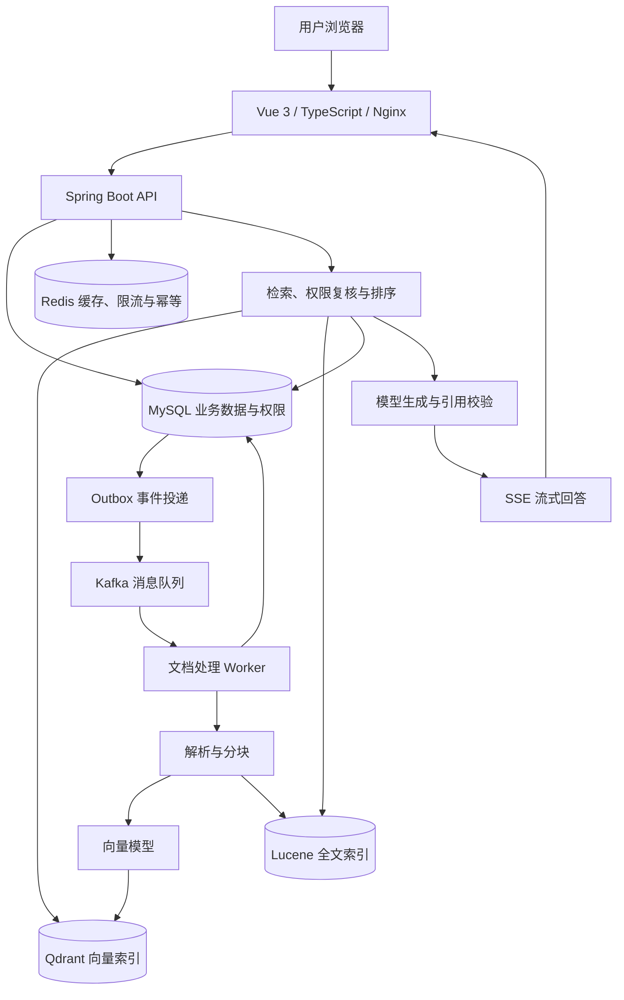

### 文档处理与数据一致性

上传接口完成文件校验、持久化和任务创建后返回，解析和模型调用由后台执行。文档任务与 Outbox 事件在同一数据库事务中提交，再通过 Kafka 投递；Worker 使用幂等接收、任务租约和重试处理重复消息及执行中断。

文档重建索引时保留已激活版本，新版本写入完成后再切换。删除文档会先更新业务状态，再由后台清理向量数据。MySQL 保存文档状态和版本，检索结果返回前再次核对，确保返回的是当前可访问的有效内容。

### 检索与问答

关键词检索使用 Lucene BM25，语义检索使用 Qdrant；混合检索通过 RRF 合并两路结果，并支持调用重排模型调整顺序。系统将检索到的原文片段作为回答依据，校验引用与原文的对应关系，再通过同步接口或 SSE 返回。

会话保存用户提问、助手回答、生成状态和引用。续问接口支持结合历史问答改写检索问题，相关调用单独记录。前端提供历史会话、继续提问、引用展开和停止生成操作。

### 身份认证与运行管理

账号使用 BCrypt 密码哈希和 JWT 认证，系统角色、知识库成员及用户组授权由 MySQL 管理。服务端在请求处理时读取账号状态与权限，Redis 承担缓存、接口限流和请求幂等协调。

模型调用设置连接、首字、空闲和总时限，支持有限重试与备用模型。聊天、查询改写、向量生成和重排均记录调用尝试、耗时和用量；管理员可通过接口查询价格快照、费用估算、预算余额和调用汇总。预算预留与结算在 API、Worker 之间共享。

### 技术栈

| 模块 | 技术 |
| --- | --- |
| 前端 | Vue 3、TypeScript、Vite、原生 fetch 与 SSE |
| 应用框架 | Java 25、Spring Boot 4.1.1、Spring AI 2.0.1、Spring Security |
| 数据存储 | MySQL、Flyway、Redis |
| 异步任务 | Kafka、事务 Outbox、任务租约与重试 |
| 检索 | Qdrant、Lucene BM25、RRF、Rerank |
| 文件解析 | PDFBox、Apache POI、文本解析与分块 |
| 部署与接口 | Docker Compose、Nginx、OpenAPI / Swagger、健康检查、结构化日志 |

项目包含后端集成测试、前端交互与 SSE 协议测试，以及文档入库、检索、问答引用、索引对账和容器恢复的验证脚本。检索评测集包含 20 篇文档和 50 条问题，保存了逐条结果和多种检索方式的对照记录。

## 部署与文档

Docker Compose 可启动前端、API、Worker、MySQL、Redis、Kafka 和 Qdrant。按 [部署说明](docs/local-deployment.md) 配置 `.env` 中的数据库、认证和模型参数后，在仓库根目录执行：

```bash
docker compose --profile app up -d --build --wait --wait-timeout 180
```

默认访问地址为 [http://127.0.0.1:8088](http://127.0.0.1:8088)，接口文档位于 `/swagger-ui/index.html`。

| 内容 | 入口 |
| --- | --- |
| 部署与运行 | [本地部署](docs/local-deployment.md) |
| 前端使用与开发 | [前端说明](frontend/README.md) |
| 示例资料 | [人力行政](docs/examples/hr)、[产品研发](docs/examples/engineering)、[客户服务](docs/examples/service) |
| 权限实现 | [用户组与知识库共享](docs/departments.md) |
| 检索与问答设计 | [混合检索](docs/bm25-design.md)、[重排](docs/rerank-design.md)、[问答引用](docs/answer-design.md)、[会话管理](docs/conversation-design.md) |
| 任务与索引管理 | [任务恢复](docs/task-recovery.md)、[外部索引对账](docs/external-reconciliation.md) |
| 评测资料 | [检索评测集](evaluation/v1/README.md)、[评测记录](docs/evaluation-v1.md) |

```text
KnowFlowAI/
├── frontend/       前端页面与交互测试
├── src/            后端服务、数据库迁移与集成测试
├── docs/           技术文档、示例资料与界面截图
├── evaluation/     检索评测数据集
├── scripts/        演示、评测和运行验证脚本
└── compose.yaml    容器编排配置
```
