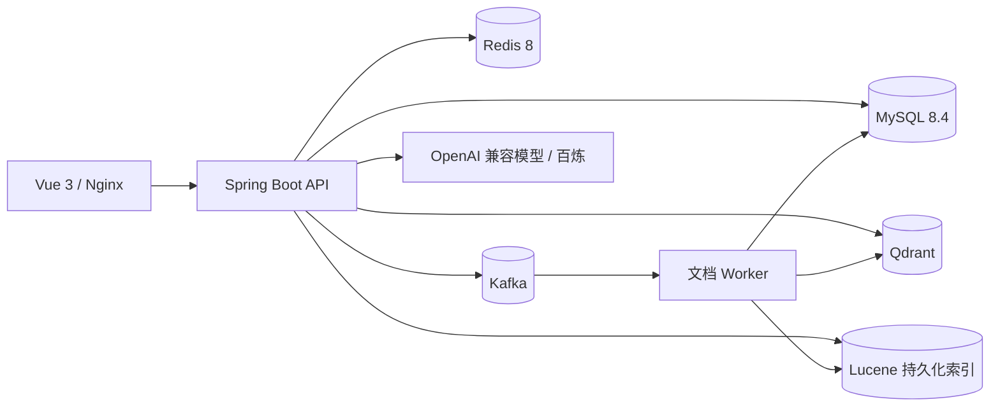

# KnowFlow AI 项目交付材料

## 架构



API 和 Worker 使用同一应用制品、两个进程；Kafka 负责文档解析、分块、Embedding 和索引任务。MySQL 是业务状态源，Redis 只承担缓存、限流和幂等协调，权限在检索返回前再次从 MySQL 核验。

## 本地演示

```powershell
Copy-Item .env.example .env
# 按需填写模型地址、模型名和密钥
docker compose --profile app up -d --build --wait --wait-timeout 180
```

打开 `http://127.0.0.1:8088`，按“注册 → 登录 → 创建知识库 → 上传文档 → 查看任务 → 搜索 → 问答”演示。Swagger 地址为 `http://127.0.0.1:8088/swagger-ui/index.html`。停止服务使用 `docker compose --profile app down`；不加 `-v` 会保留数据卷。

## 已验证证据

- JDK 25 完整回归：260 项后续增量测试记录见 `target` 日志。
- 外部索引对账和容器恢复演练：`external-reconciliation.md`、`recovery-drill.md`。
- 真实 v1 检索、Rerank 和问答引用评测：`evaluation-v1.md` 及 `docs/validation/` 原始 JSON。
- 协议替身 HTTP、SSE、异步入库压测：`load-testing.md` 及 `docs/validation/2026-09-04-load-test-fixture.json`。

## 简历描述（仅使用已有证据）

KnowFlow AI｜企业知识治理与智能检索平台

- 设计 Spring Boot 单体双进程架构，使用 Kafka 异步完成 PDF/Markdown/DOCX/TXT 文档解析、分块、Embedding 与 Qdrant 入库，任务状态支持幂等、租约、重试和恢复。
- 实现 MySQL ACL 驱动的 RBAC 知识库权限过滤，结合 Lucene BM25、Qdrant 向量检索和 RRF 融合，并接入可回退的 Rerank；真实 v1 数据集完成 50 条问题对比评测。
- 基于 Spring AI 实现带原文引用的同步问答和 SSE 流式输出，覆盖引用校验、撤权复核、超时、有限重试、Fallback、Redis 限流与幂等。
- 使用 Docker Compose 部署 Vue/Nginx、API、Worker、MySQL、Redis、Kafka、Qdrant，补充外部索引对账、故障恢复演练和可复现评测脚本。

简历中不要填写尚未由真实压测证明的吞吐量、延迟或质量提升百分比；当前真实评测已如实记录 Rerank 在 v1 样本中未提升指标。
